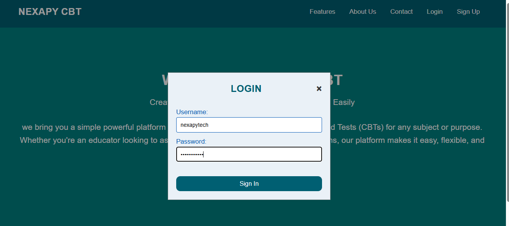
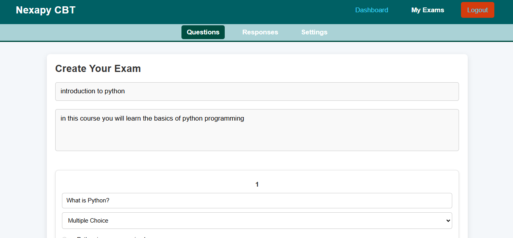
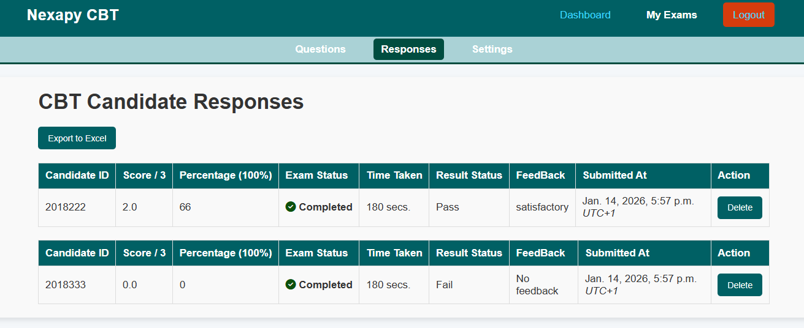

# NexapyCBT  Python Django Computer-Based Testing Platform

## 🌐 Live Demo

**Watch the live demo video:** [YouTube Demo](https://www.youtube.com/watch?v=j_YBNhYRwJ)

--- 

## 🛠 Tech Stack
- **Language:** Python 3
- **Backend Framework:** Django
- **Database:** MySQL, sqlite3
- **Containerization:** Docker
- **NLP & AI:** spaCy (text similarity)
- **OS Tested On:** Linux (Ubuntu recommended)

---

## 🔥 Overview
NexapyCBT is a cutting-edge platform designed to revolutionize the way exams are taken.  
With the flexibility to create, manage, and participate in Computer-Based Tests (CBTs), NexapyCBT provides a seamless, efficient, and secure testing experience for both educators and learners.

---

## 🚀 Features
- Create unlimited exams
- Unlimited questions per exam
- Delete exams
- Upload questions via Excel
- Publish unlimited exams
- Enable feedback for exams
- Role-based access: admin, instructor, student
- Automated grading and result tracking
- Secure exam delivery
- NLP-powered features using spaCy

---

## 🧠 NLP & spaCy Integration
NexapyCBT integrates spaCy to enhance evaluation of non-multiple-choice (theory/subjective) questions.

**How it works:**
1. Theory answers are processed using text similarity techniques.
2. Student responses are compared with expected answers.
3. spaCy’s pretrained language model enables semantic similarity matching.

This allows fair grading even when students use different wording.  
Instructors can still review or override results when necessary.  
This approach improves automated assessment while keeping human oversight where required.

---

### Screenshots 

**Login Screen**  


**Create Exam**  


**Dashboard**  


**Results Page**  



---

**Example Grading with spaCy:**


```python
import spacy

nlp = spacy.load("en_core_web_md")

correct_answer = nlp("The capital of France is Paris.")
student_answer = nlp("Paris is the capital of France.")

similarity_score = student_answer.similarity(correct_answer)
print(f"Similarity Score: {similarity_score:.2f}")

if similarity_score > 0.85:
    grade = "Correct"
else:
    grade = "Needs review"

print("Grade:", grade)

```

### ⚙️ Make Commands
To make your repo **easy to run and test**, we provide a Makefile:
### Run the API locally
```bash
make run
### Run all tests
make test
### make up
make up
### Stop docker Container
make down
### apply Django Migrations
make migrate
### make admin user
make createsuperuser
### Run code linting & formatting checks
make lint

```

---

### Optional MySQL
Uncomment the following variables in your `.env` file if you want to use MySQL:

```env
DB_NAME='cbt_db'
DB_USER='cbt_user'
DB_PASSWORD='cbt_pass'
DB_HOST='localhost'
DB_POR

### Start containers
``` bash
docker-compose up

### Apply migrations (if not using auto-run)
docker-compose run web python manage.py migrate

### Create a superuser
docker-compose run web python manage.py createsuperuser

### Stop containers
docker-compose down

```
### Static Files (Production)
Static files are generated using: 

 python manage.py collectstatic

 ---
 
### ⚙️ Local Setup (Linux / Windows)

### 1. Clone the repo
``` bash
git clone https://github.com/nexapytech/django-cbt-platform.git.

cd django-cbt-platform 

```
### Docker Setup (Recommended)
```bash
docker build -t nexapycbt .
docker run -p 8000:8000 nexapycbt

```


